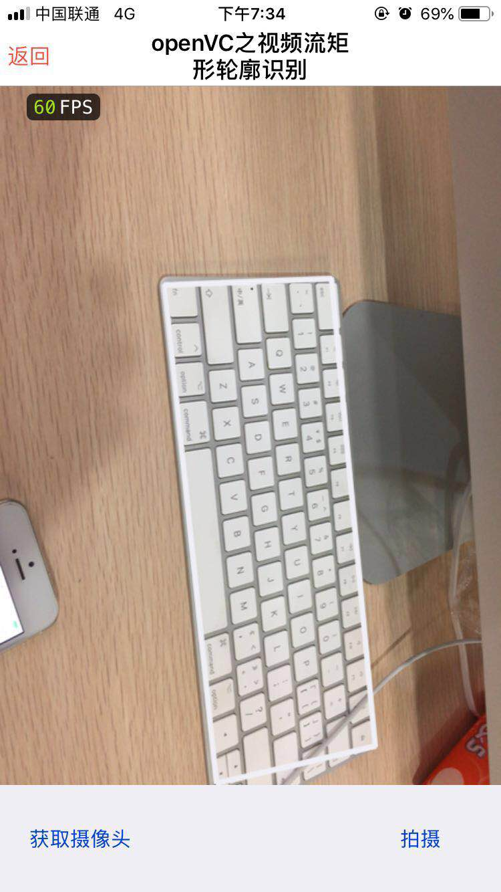

# LHQOpenCV




#### 由于openCV 这个库单体文件大于100M ，传不上github。该demo没有导入openCV，导入了就可以使用了
 （pod 'OpenCV','~> 2.4.13'）最新的版本，由于有些接口改变太多，我这边导入的事2.4.13版本。

##### 1. 矩形的边缘检测及裁剪
 ```
 void find_squares(cv::Mat& image, std::vector<std::vector<cv::Point>>&squares) {
    
    // blur will enhance edge detection
    
    cv::Mat blurred(image);
    //    medianBlur(image, blurred, 9);
    GaussianBlur(image, blurred, cvSize(11,11), 0);//change from median blur to gaussian for more accuracy of square detection
    
    cv::Mat gray0(blurred.size(), CV_8U), gray;
    std::vector<std::vector<cv::Point> > contours;
    
    // find squares in every color plane of the image
    for (int c = 0; c < 3; c++)
    {
        int ch[] = {c, 0};
        mixChannels(&blurred, 1, &gray0, 1, ch, 1);
        
        // try several threshold levels
        const int threshold_level = 2;
        for (int l = 0; l < threshold_level; l++)
        {
            // Use Canny instead of zero threshold level!
            // Canny helps to catch squares with gradient shading
            if (l == 0)
            {
                Canny(gray0, gray, 10, 20, 3); //
                //                Canny(gray0, gray, 0, 50, 5);
                
                // Dilate helps to remove potential holes between edge segments
                dilate(gray, gray, cv::Mat(), cv::Point(-1,-1));
            }
            else
            {
                gray = gray0 >= (l+1) * 255 / threshold_level;
            }
            
            // Find contours and store them in a list
            findContours(gray, contours, CV_RETR_LIST, CV_CHAIN_APPROX_SIMPLE);
            
            // Test contours
            std::vector<cv::Point> approx;
            for (size_t i = 0; i < contours.size(); i++)
            {
                // approximate contour with accuracy proportional
                // to the contour perimeter
                approxPolyDP(cv::Mat(contours[i]), approx, arcLength(cv::Mat(contours[i]), true)*0.02, true);
                
                // Note: absolute value of an area is used because
                // area may be positive or negative - in accordance with the
                // contour orientation
                if (approx.size() == 4 &&
                    fabs(contourArea(cv::Mat(approx))) > 1000 &&
                    isContourConvex(cv::Mat(approx)))
                {
                    double maxCosine = 0;
                    
                    for (int j = 2; j < 5; j++)
                    {
                        double cosine = fabs(angle(approx[j%4], approx[j-2], approx[j-1]));
                        maxCosine = MAX(maxCosine, cosine);
                    }
                    
                    if (maxCosine < 0.3)
                        squares.push_back(approx);
                }
            }
        }
    }
}
 ```


##### 2. 矩形的实时边缘检测及（视频流）
```

#pragma mark -- CvVideoCameraDelegate
- (void)processImage:(cv::Mat&)image{
    
    //image对象就是视频流时时返回的对象，一秒可达30帧；用一个Mat对象（imageClone）对返回的image对象拷贝
    cv::Mat imageClone = image.clone();

    std::vector<std::vector<cv::Point> > squares;
    
    //图片灰度处理
    cv::Mat src_gray;
    //第一个参数为转换前的image，第二个参数为，转换后的image，第三个参数为需要转换成什么样的图片，这边为灰度图片。
    cv::cvtColor(image, src_gray, cv::COLOR_BGR2GRAY);

    // 滤波降噪，第三个参数为阈值，可以搜搜看
    cv::Mat filtered;
    cv::blur(src_gray, filtered, cv::Size(7,7));

    //边缘检测
    cv::Mat edges;
    int thresh = 50;
    cv::Canny(filtered, edges, thresh, thresh * 2, 3);

    //膨胀
    cv::Mat dilated_edges;
    cv::dilate(edges, dilated_edges, cv::Mat(), cv::Point(-1, -1), 2, 1, 1);


    // 找到轮廓并存储
    std::vector<std::vector<cv::Point> > contours;
    cv::findContours(dilated_edges, contours, cv::RETR_LIST, cv::CHAIN_APPROX_SIMPLE);

    std::vector<cv::Point> approx;
    for (size_t i = 0; i < contours.size(); i++) {

        //找出轮廓的凸包
        cv::convexHull(contours[i], approx) ;
        // 对cv::arcLength(cv::Mat(approx), true)*0.02这个阈值外的线条进行拟合
        cv::approxPolyDP(cv::Mat(approx), approx, cv::arcLength(cv::Mat(approx), true)*0.02, true);

        if (approx.size() == 4 && std::fabs(contourArea(cv::Mat(approx))) > 1000 &&
            cv::isContourConvex(cv::Mat(approx)))
        {
            double maxCosine = 0;
            for (int j = 2; j < 5; j++)
            {
                double cosine = std::fabs(anglec(approx[j%4], approx[j-2], approx[j-1]));
                maxCosine = MAX(maxCosine, cosine);
            }

            if (maxCosine < 0.3)
                squares.push_back(approx);
        }

    }

//    至此，你可以发现，用了一个白色的框，框住了身份证的大轮廓。
    std::vector<cv::Point> largest_square;
    find_largest_squarec(squares, largest_square);

    const cv::Point* p = &largest_square[0];
    int n = (int)largest_square.size();
    cv::polylines(image, &p, &n, 1, true, cv::Scalar(0, 0, 0), 3, CV_AA);

    _currentMat = image;
    _imgView.image = [MMOpenCVHelper UIImageFromCVMat:_currentMat];
}

void find_squaresc(cv::Mat& image, std::vector<std::vector<cv::Point>>&squares) {
    
    // blur will enhance edge detection
    
    cv::Mat blurred(image);
    //    medianBlur(image, blurred, 9);
    GaussianBlur(image, blurred, cvSize(11,11), 0);//change from median blur to gaussian for more accuracy of square detection
    
    cv::Mat gray0(blurred.size(), CV_8U), gray;
    std::vector<std::vector<cv::Point> > contours;
    
    // find squares in every color plane of the image
    for (int c = 0; c < 3; c++)
    {
        int ch[] = {c, 0};
        mixChannels(&blurred, 1, &gray0, 1, ch, 1);
        
        // try several threshold levels
        const int threshold_level = 2;
        for (int l = 0; l < threshold_level; l++)
        {
            // Use Canny instead of zero threshold level!
            // Canny helps to catch squares with gradient shading
            if (l == 0)
            {
                Canny(gray0, gray, 10, 20, 3); //
                //                Canny(gray0, gray, 0, 50, 5);
                
                // Dilate helps to remove potential holes between edge segments
                dilate(gray, gray, cv::Mat(), cv::Point(-1,-1));
            }
            else
            {
                gray = gray0 >= (l+1) * 255 / threshold_level;
            }
            
            // Find contours and store them in a list
            findContours(gray, contours, CV_RETR_LIST, CV_CHAIN_APPROX_SIMPLE);
            
            // Test contours
            std::vector<cv::Point> approx;
            for (size_t i = 0; i < contours.size(); i++)
            {
                // approximate contour with accuracy proportional
                // to the contour perimeter
                approxPolyDP(cv::Mat(contours[i]), approx, arcLength(cv::Mat(contours[i]), true)*0.02, true);
                
                // Note: absolute value of an area is used because
                // area may be positive or negative - in accordance with the
                // contour orientation
                if (approx.size() == 4 &&
                    fabs(contourArea(cv::Mat(approx))) > 1000 &&
                    isContourConvex(cv::Mat(approx)))
                {
                    double maxCosine = 0;
                    
                    for (int j = 2; j < 5; j++)
                    {
                        double cosine = fabs(anglec(approx[j%4], approx[j-2], approx[j-1]));
                        maxCosine = MAX(maxCosine, cosine);
                    }
                    
                    if (maxCosine < 0.3)
                        squares.push_back(approx);
                }
            }
        }
    }
}
```
